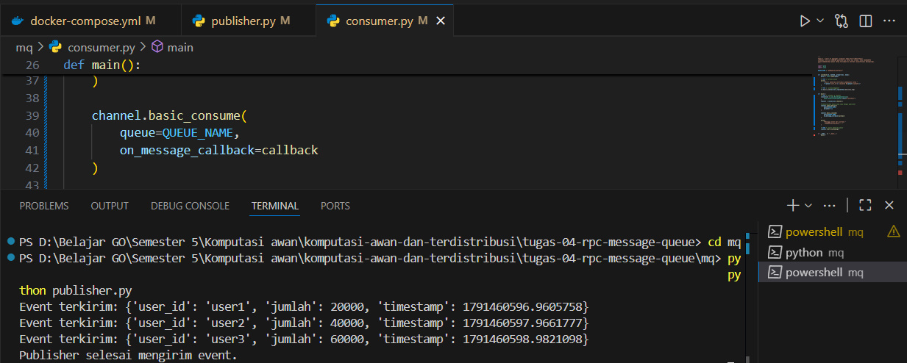
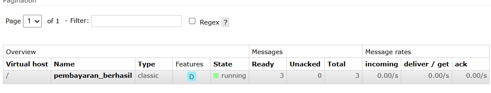
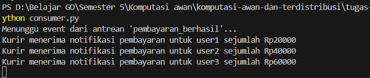

# Tugas 4 (Pekan 4) — Komunikasi Antar Komponen

**Materi terkait:** Remote Procedure Call (RPC), Message-Oriented Middleware (MOM)/Message Queue.

## Studi Kasus

Modul **Pembayaran** dan modul **Pesanan** FoodGo harus berkomunikasi secara reliabel. Untuk beberapa operasi (mis. cek status saldo) respons dibutuhkan **seketika** (sinkron). Untuk operasi lain (mis. kirim notifikasi "pembayaran berhasil" ke modul kurir) sistem **tidak boleh menunggu** — modul pembayaran harus tetap responsif walau modul kurir sedang sibuk/down (asinkron).

## Tugas Kelompok

1. Lengkapi bagian `# TODO` di jalur yang dipilih.
2. Buktikan program benar-benar berjalan (screenshot 2 terminal berdampingan, atau video).
3. Untuk Jalur B, matikan dulu `consumer.py`, jalankan `publisher.py` beberapa kali, lalu nyalakan `consumer.py` — buktikan pesan **tetap diproses** (tidak hilang) karena antrean menyimpannya. Ini adalah inti pembelajaran *asynchronous decoupling*.
4. Tulis analisis: kenapa jalur ini (RPC atau MQ) cocok untuk skenario yang kalian pilih, dan apa yang terjadi jika dipakai untuk skenario yang salah (mis. RPC dipakai untuk notifikasi kurir → modul pembayaran ikut lambat kalau kurir down).

## Jawaban

## Consumer dimatikan + Publisher mengirim pesan

## Bukti pesan tersimpan di RabbitMQ

## Consumer dinyalakan kembali

## Analisis Pemilihan Jalur

Kami memilih Jalur B, yaitu Message Queue (MQ) menggunakan RabbitMQ, karena
komunikasi antara modul Pembayaran dan modul Kurir/Notifikasi tidak harus
berlangsung secara langsung atau menunggu respons dari modul lain.

Pada sistem ini, setelah pembayaran berhasil, modul Pembayaran mengirimkan event
`pembayaran_berhasil` ke RabbitMQ. Pesan tersebut disimpan di dalam antrean dan
dapat diproses oleh modul Kurir/Notifikasi ketika consumer tersedia. Dengan
demikian, kedua modul tidak saling bergantung secara langsung dan proses
pembayaran tetap dapat berjalan meskipun modul Kurir/Notifikasi sedang tidak
aktif.

Penggunaan Message Queue juga memberikan keuntungan asynchronous decoupling.
Hal ini dibuktikan ketika `consumer.py` dimatikan, kemudian `publisher.py`
mengirimkan beberapa pesan. Pesan tetap tersimpan di antrean RabbitMQ dan dapat
diproses setelah `consumer.py` dinyalakan kembali.

Sebaliknya, jika RPC digunakan untuk skenario notifikasi kurir, modul Pembayaran
harus menunggu respons langsung dari modul Kurir. Jika modul Kurir sedang down
atau mengalami gangguan jaringan, proses komunikasi dapat mengalami timeout
atau error sehingga modul Pembayaran ikut terdampak dan menjadi lebih lambat.

Jadi, Message Queue lebih cocok untuk proses notifikasi yang bersifat
asynchronous karena pengirim tidak perlu menunggu consumer untuk memproses
pesan.